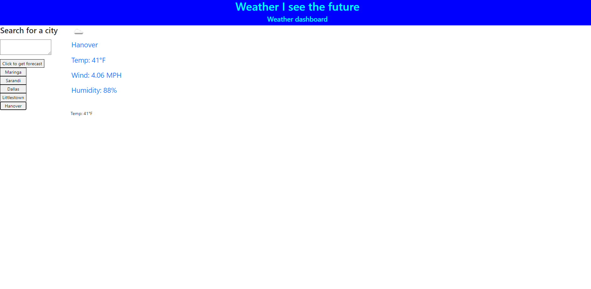

## Module 5 Challenge - Work day scheduler

## Description

This is a wather dashboard created with Javascript . It's designed to consolidate what was learned in module 6, and it serves as a way to stay prepared for the weather when traveling. The searched cities will be saved in local storage and rendered into the page when clicked. 

## Overview

Type in the city and you will be given a weather report for that city,

Click the saved cities to be given a weather report as well,

## Screenshots

## License

Please refer to the LICENSE in the repo.

## Link to deployed application

https://eliasallan.github.io/Weather-I-see-the-future/